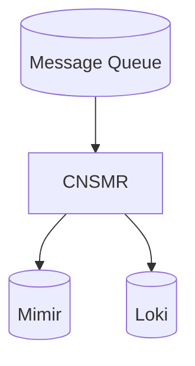
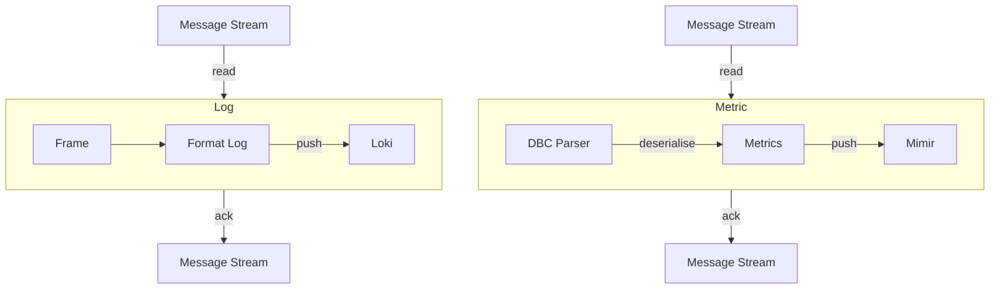

#explanation 

The consumer service takes data from the ingest message queue, processes it and then pushes that data to the respective stores.

# Overview

# Deserialisation Process

There are separate stream keys storing the same frames which are processed by the consumer in separate threads. This adds resiliency; stopping an issue with Loki causing metrics to stop being pushed to Mimir and vice-versa.

The logs produced are just a textual encoding of the CAN bus frame, allowing our platform the re-process frames or even deserialise historical data at a later date.

The metric pipeline will produce none, one, or many series per frame depending on the schema defined in the DBC file. If the frame doesn't match any of the messages in the DBC file, it is discarded.
