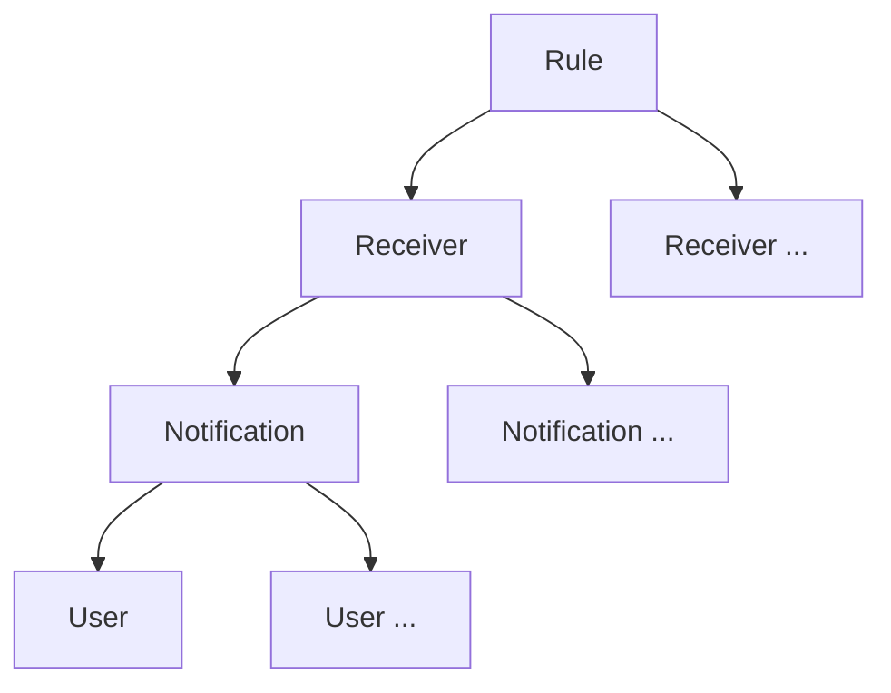

#explanation 

```mermaid
graph TD
	rule[Rule] --> receiver[Receiver]
	rule --> receivers[Receiver ...]
	receiver --> notification[Notification]
	receiver --> notifications[Notification ...]
	notification --> user[User]
	notification --> users[User ...]
```

- Rule - alert rule.
- Receiver - alert receiver.
- Notification - notification.
- User - individual user account.
