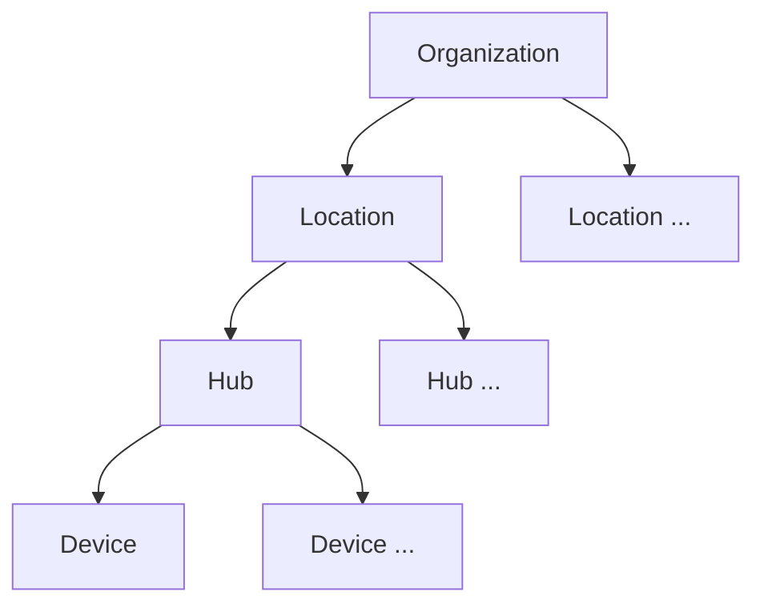

#explanation 

- Organization - Logical grouping of locations.
- Location - physical representation of an installation site.
- Hub - Nexus or other gateway device.
- Device - connected energy appliances.

Note: when a hub is initially registered to an organization, it may not have a location assigned.