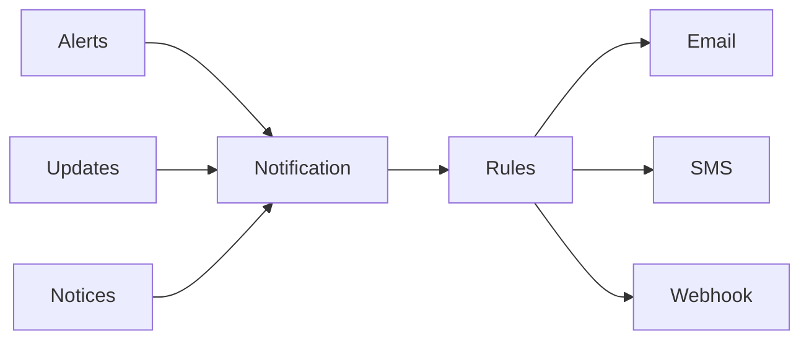

#explanation 
# Overview

# Alerts

See [alerts](Design/Cloud/Telemetry/Alerting.md) for more details.

# Rules

The notification rules and the encoding of the users preferences for what notifications they want to receive and where they want to receive them.

# Receivers

Receives are where notifications are sent to and are configured by the user based on their needs.
