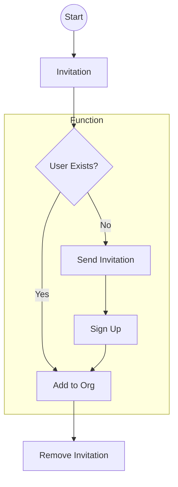

#explanation

# Invitation Flow

```mermaid
graph TD
  Start((Start)) --> Invitation
  Invitation --> Exists{User Exists?}
  subgraph Function
	Exists -- Yes --> Add[Add to Org]
	Exists -- No --> Send[Send Invitation]
	Send --> SignUp[Sign Up]
	SignUp --> Add
  end
  Add --> RemoveInvite[Remove Invitation]
```
