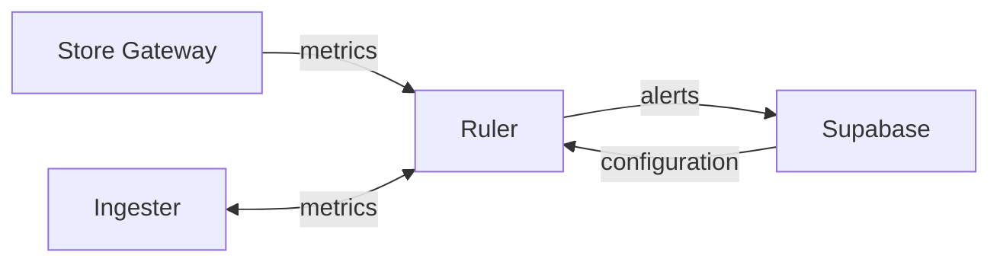

#explanation 

# Overview

# Federated Rule Groups

In order to evaluate rules across tenants federated rule groups are required as we give each hub its own tenant rather than at the org scope.

See the [docs](https://grafana.com/docs/mimir/latest/references/architecture/components/ruler/#federated-rule-groups) for more details.

# Dynamic Configuration

In the Supabase database there exists the configuration that can be transformed and applied to Mimir to configure the ruler as needed. This allows users to have a simplified configuration experience whilst still leveraging the power of Prometheus Rules and Mimir.
