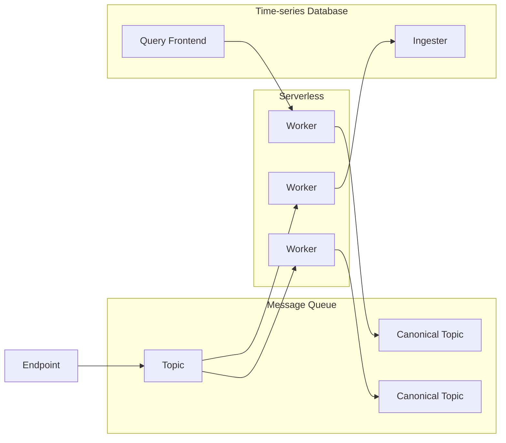
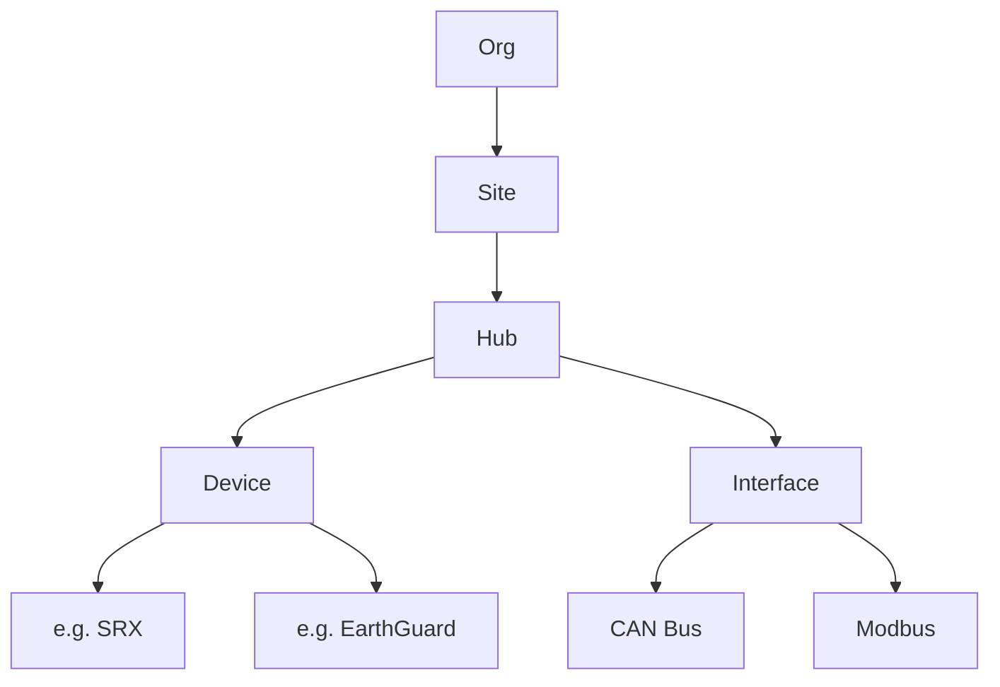
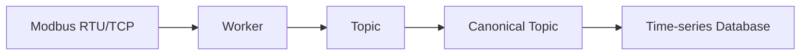

#explanation 

# Problems with current design

- Data is only available once it has been committed to the TSDB.
	- Data changes can only be polled by listeners.
- There is no aggregation into canonical data streams.
	- Data is highly specific to the device which doesn't scale.

# New design

This new design is:
- Event driven.
- Functionally pure.
- Serverless.



## Workers

Workers a serverless functions, preferably built on WebAssembly, allowing them to be deployed anywhere.

## Topic Organization

Topics are identified by their subject which is a path in a hierarchical tree.
### Subject Hierarchies

```
// example topics
hub.<machine-id>.canbus.frame.<id>
hub.<machine-id>.canbus.frame.* // listen for all ids
hub.<machine-id>.modbus.frame
// example canonical topics
site.<id>.battery.power
site.<id>.battery.soc
site.<id>.inverter.power
```



```
// canbus frame queue
org.*.site.*.hub.*.ingest.canbus.frames
// canbus device id mapping
org.*.site.*.hub.*.device.*.meta.canbus_device_id
// telemetry data
org.*.site.*.hub.*.device.*.data.voltage.input
org.*.site.*.hub.*.device.*.data.voltage.output
org.*.site.*.hub.*.device.*.data.current.output
org.*.site.*.hub.*.device.*.data.power.output
org.*.site.*.hub.*.device.*.data.power.input
// aggregated data
org.*.site.*.hub.*.data.power.output // hub level data
org.*.site.*.data.power.output // site level data
org.*.data.power.output // org level data
```

- org
	- site
		- hub
		- interface
			- canbus
				- configuration
				- frames
			- modbus
				- configuration

This allows for ACLs to be applied. For example, a hub can only access its own data by scoping it's read/write permissions to `hub.<machine-id>.*`
## Topics vs Canonical Topics

Topics are for any kind of data stream that needs to pass through the system. Usually they are highly specific.

Canonical topics are aggregated and normalised data streams, typically sourcing data from other topics or services.

## Example Data Stream



In this example, the "Worker" function can be running in the cloud or at the edge.