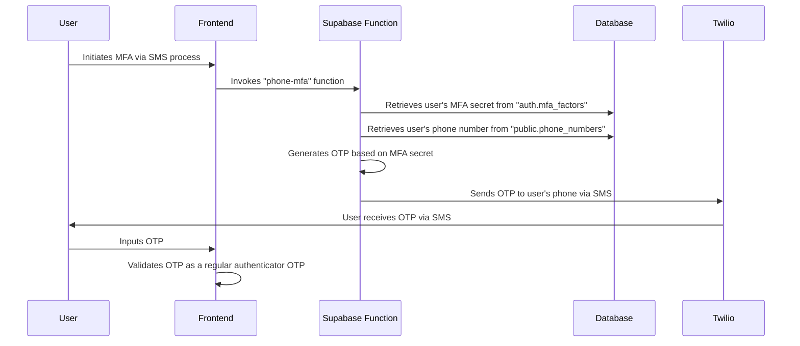

#explanation 

# Documentation for MFA Process

## Introduction

Our web app leverages Multi-Factor Authentication (MFA) to provide an additional layer of security for users. While our backend, Supabase, offers native support for MFA through authenticator apps, we have expanded the system to support MFA through SMS by creating a custom function. The following document will guide you through this setup.

## MFA Process Overview

### Authenticator Apps

Users can set up MFA using authenticator apps as per the [Supabase documentation](https://supabase.com/docs/guides/auth/auth-mfa).

### SMS Authentication

Our web app supports SMS-based MFA, although Supabase does not natively provide this feature. We've implemented a custom MFA client that uses phone numbers to achieve this functionality. The client works in the following steps:

1. The user initiates the SMS-based MFA process by clicking a button on the web app, triggering the `phone-mfa` function in Supabase.
2. The `phone-mfa` function queries the database to fetch the user's phone number and MFA secret.
3. An One-Time Password (OTP) is generated based on the user's MFA secret.
4. The OTP is sent to the user's phone number via SMS using the Twilio SMS API.
5. The user inputs the OTP in the frontend of the web app, where it is validated as a regular OTP generated by an authenticator app.

The following sequence diagram illustrates this process:

This diagram visualises the flow of data and operations from the user's request to the OTP validation. Note that the actual OTP is generated on our server, ensuring the integrity and confidentiality of the process.