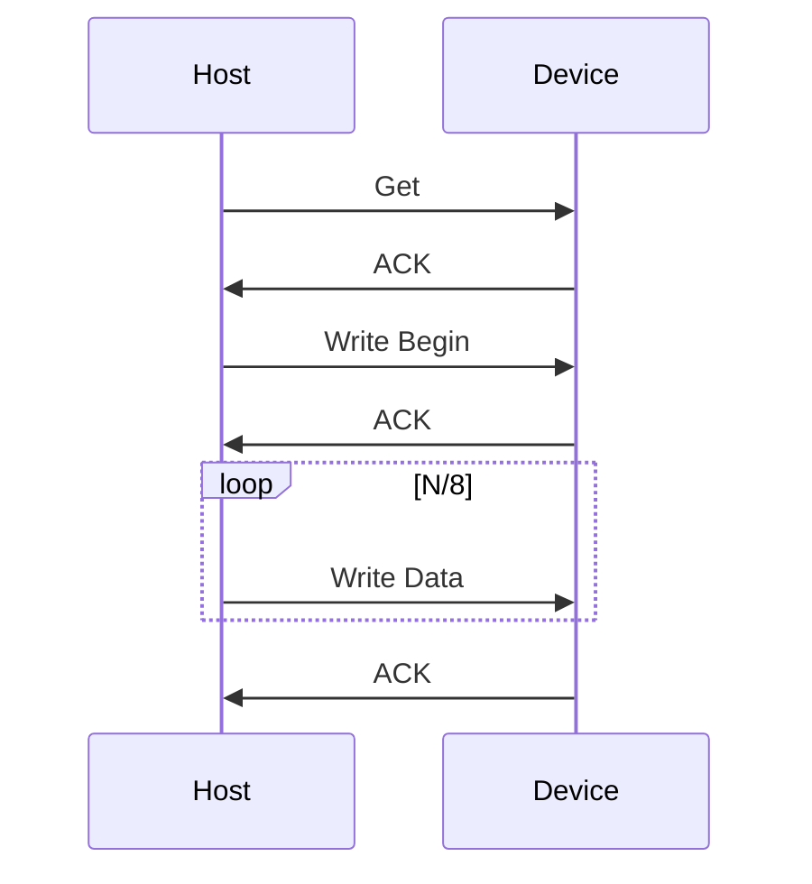
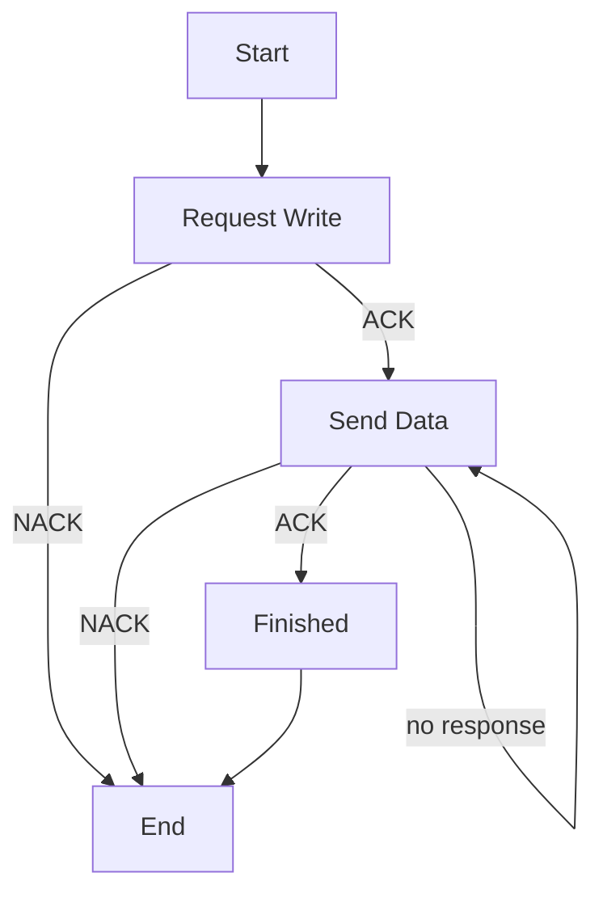

#explanation 

This document specifies the protocol used to load new firmware onto connected AERL devices such as SRX, EarthGuard and SmartVT.
# Bootloader Specification

## Bootloader Sequence


## Command Set

- Get Info (0x02): Get the current firmware version and device serial number.
- Write Memory Begin (0x03): Specify the target device (all or specific serial #) and the size of the write operation.
- Write Memory Data (0x04): Write up to 256 bytes to the device.
- Reboot (0x05): Reboot the device to apply the firmware from flash.

## Response Set

- ACK (0x00): Accepted
- NACK (0x01): Not-accepted

Note: The first data byte contains the ID of the command being responded to. The remaining contents of ACK and NACK are specific to the command they are responding to.

### ACK Data Format

Length: 3 bytes

```
| serial number |
23              0
```

### NACK Data Format

Length: 4 bytes

```
| code | serial number |
31   24 23             0
```

#### NACK Codes

| Code | Description |
|---|---|
| 0 | Unknown reason |
| 1 | Time-out waiting for response |
| 2 | Write request address out of bounds |
| 3 | Write data checksum failed |

This allows the host to filter NACK responses.

## Get Info Command (0x02)

### Response Data Format

Length: 7

```
| firmware version | bootloader version | serial number |
55               32 31                24 23             0
```

Note: firmware version occupies 3 bytes containing the major, minor, and patch numbers.
## Write Memory Begin Command (0x03)

### Data Format

```
| CRC-16 | n bytes | address |
55     40 39     32 31       0
```

Note: the data includes:
- Start address
- Number of bytes to be written
- A 16-bit CRC checksum which the device uses to verify each block of data.

### Write Memory Host Side



Note: the number of frames sent will be N/8 where N is the number of bytes to be written. In a typical firmware loading scenario, only the last transfer of writes will be less than 256 bytes in length.

Note: the frequency of writes should be limited to not use more than 20% of the expected bus capacity as to not interrupt communication between other devices. See [notes](#notes) for more details.

# Notes

## Expected Boot-load Duration

Worst case the throughput of a 500kbps CAN bus is 244.28kb/s.
Limiting bus usage to 20%, the expected data rate is as follows:

```
data rate = 0.2 * (244.28 / 8)
          = 0.2 * 30.535
          = 6.107 kB/s
```

Worst case firmware size is that of the STM32 memory which is 64kB in size.
Therefore the longest boot-load duration is:

```
duration = 64 / 6.107
		 = 10.48 seconds
```
