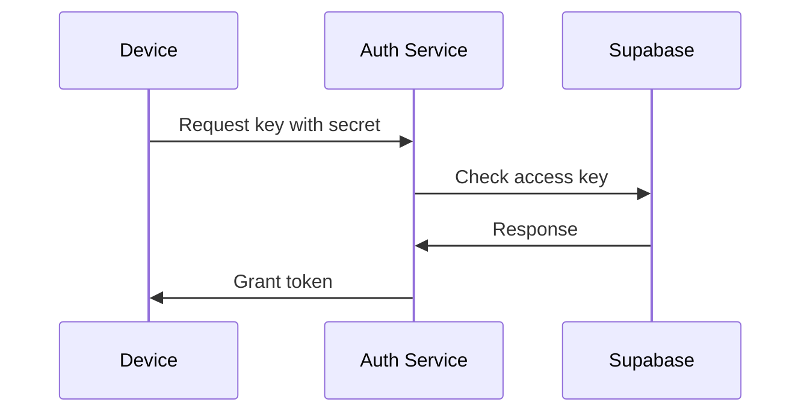

#explanation 

# Overview

We need to ensure that devices which make requests to our services are only devices we have authorised.

# Token Grant Flow

# Auth Service

The auth service mints JWT tokens as needed by the devices. The tokens it mints have the `device` role allowing devices to interact with the Supabase API like users and other services.
